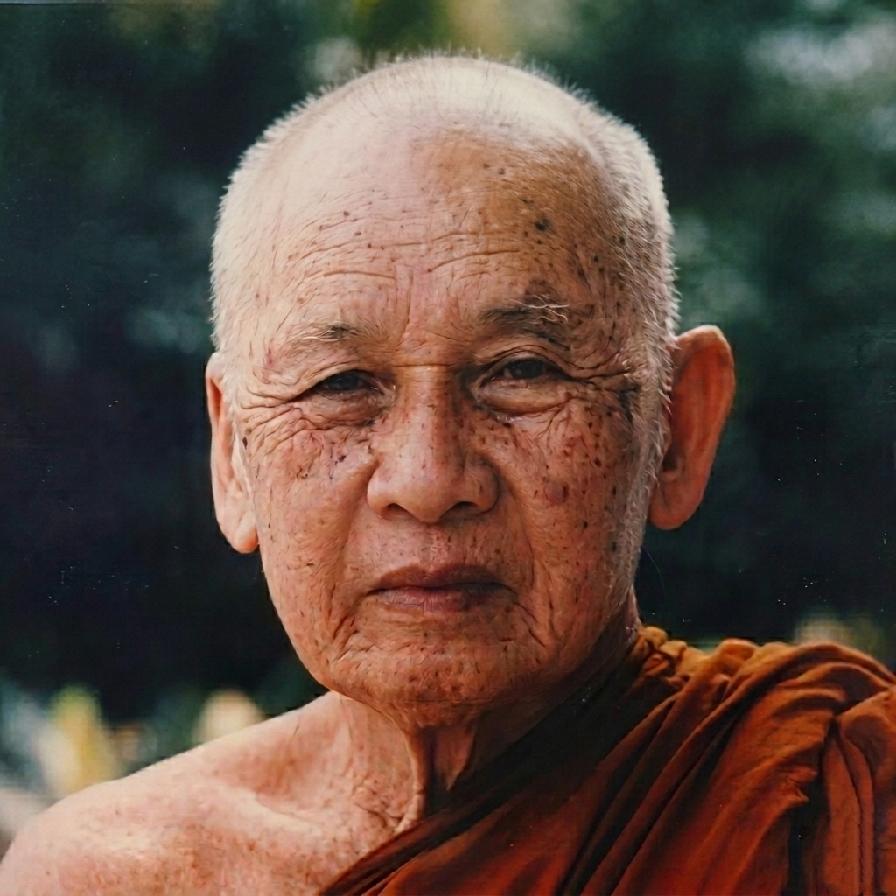

# Ajahn Thate Desaraṅsī Archive

A digital collection of the teachings, writings, and life history of Phra Rajanirodharangsee (1902–1994), a revered founding master of the Thai Forest Tradition.

---

## Legacy of Stillness

### The Path of a Forest Monk

|  | Venerable Ajahn Thate Desaraṅsī (1902–1994) was one of the foundational pillars of the modern Thai Forest Tradition. As a direct disciple of Ajahn Mun Bhūridatta, his life epitomized radical simplicity, deep meditative stabilization, and compassionate teaching.  For over seventy years in the robes, he traversed remote wildernesses, subdued the mind through isolated practice, and built communities centered around pure monastic discipline (Vinaya).  [Read his full Autobiography →](https://meormine.github.io/ajahn-thate/autobiography.html) |
| --- | --- |

---

> "Direct mindfulness so that it keeps closely aware of the mind. Let wisdom's only function be to purge the out-wanderings of the heart and return it to a state of complete stillness."
>
> — **Ajahn Thate Desaraṅsī**, *Steps Along the Path*

---

## Explore the Archive

- [**Autobiography**](https://meormine.github.io/ajahn-thate/autobiography.html) — Explore the life and journey of Ajahn Thate, from his early years to his time as a wandering forest monk.
- [**Dhamma Talks**](https://meormine.github.io/ajahn-thate/dhamma_talks.html) — An archive of recorded teachings, transcripts, and practical meditation advice given to his disciples.
- [**Dhamma Books**](https://meormine.github.io/ajahn-thate/dhamma_books.html) — Published writings, essays, and complete books translated into English.
- [**Dhamma Quotes**](https://meormine.github.io/ajahn-thate/dhamma_quotes.html) — Brief, impactful reflections and daily inspiration excerpted from his lifelong teachings.
- [**Downloads**](https://meormine.github.io/ajahn-thate/download.html) — Access the full audio archive and the mobile application for offline listening.

---

*For the complete experience, visit the [Ajahn Thate Desaraṅsī Archive](https://meormine.github.io/ajahn-thate/).*
